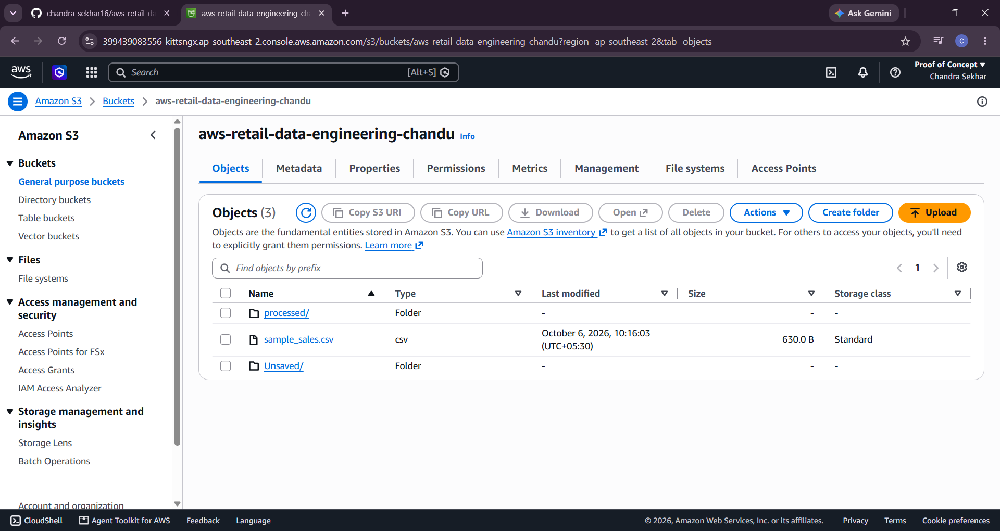
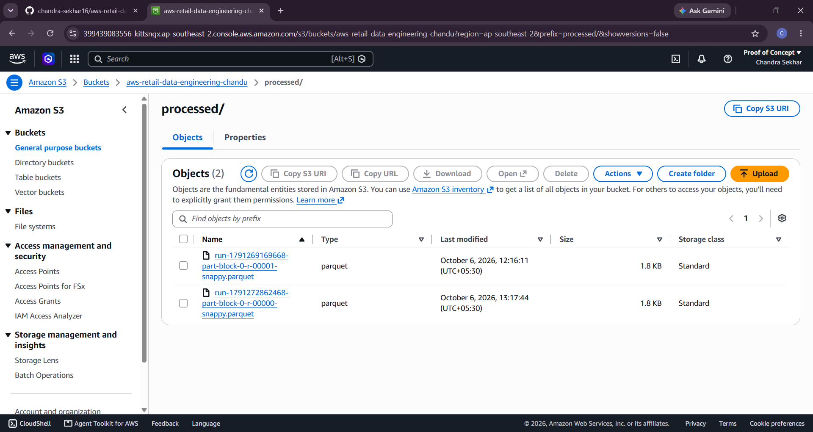
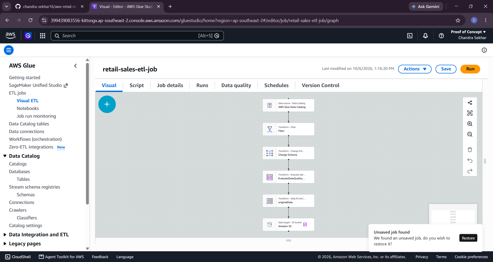
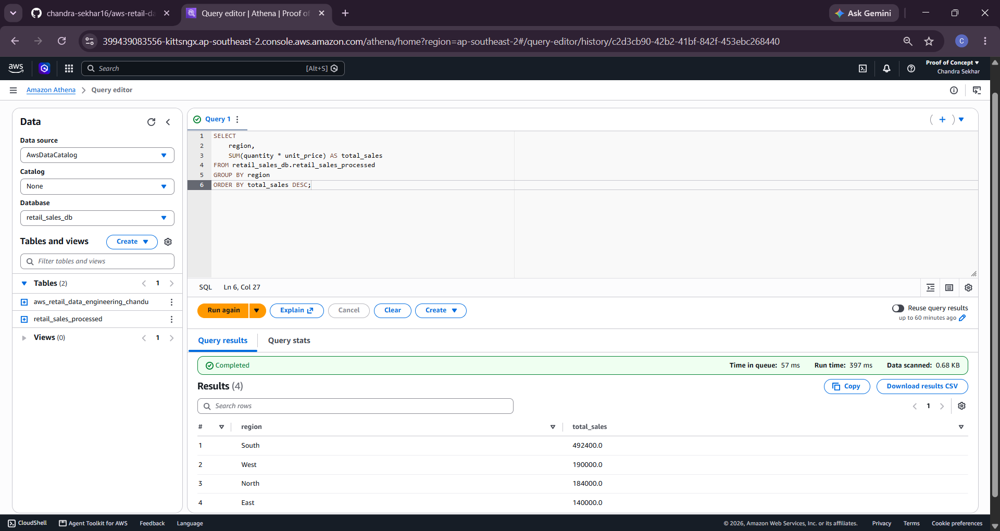

# AWS Retail Data Engineering Lakehouse Pipeline

An end-to-end cloud data engineering pipeline that ingests retail transaction data into Amazon S3, processes and audits records using AWS Glue & PySpark, converts datasets into optimized Apache Parquet format, catalogs metadata via AWS Glue Data Catalog, enables serverless SQL analytics in Amazon Athena, models a dimensional Redshift Star Schema, and automates daily workflows using Apache Airflow.

---

## 🚀 Project Overview

This project implements a scalable and cost-effective Data Lakehouse architecture on AWS for retail sales processing.

### Key Capabilities

- **Raw Data Ingestion:** Retail transaction records stored in Amazon S3.
- **Data Cleansing & Validation:** Data quality rules, type casting, and sales calculations using PySpark / AWS Glue ETL.
- **Storage Optimization:** Raw CSV records converted into Apache Parquet with Snappy compression.
- **Metadata Management:** Dataset schemas managed through AWS Glue Data Catalog.
- **Serverless SQL Analytics:** Analytical queries executed using Amazon Athena.
- **Data Warehousing:** Dimensional Star Schema designed for Amazon Redshift.
- **Workflow Orchestration:** ETL workflow automation using Apache Airflow.
- **Version Control:** Source code and documentation maintained using Git and GitHub.

---

## 🏗️ Architecture

```text
                         +-------------------------+
                         |    Retail Sales CSV     |
                         +------------+------------+
                                      |
                                      v
                         +-------------------------+
                         |       Amazon S3         |
                         |      Raw Data Layer     |
                         +------------+------------+
                                      |
                                      v
                         +-------------------------+
                         |   AWS Glue / PySpark    |
                         |   retail-sales-etl-job  |
                         +------------+------------+
                                      |
                                      v
                         +-------------------------+
                         |   Apache Parquet Files  |
                         |     processed/ layer    |
                         +------------+------------+
                                      |
                                      v
                         +-------------------------+
                         |  AWS Glue Data Catalog  |
                         |     retail_sales_db     |
                         +------------+------------+
                                      |
                     +----------------+----------------+
                     |                                 |
                     v                                 v
          +----------------------+          +----------------------+
          |    Amazon Athena     |          |   Amazon Redshift    |
          |  Serverless SQL      |          |    Star Schema       |
          +----------+-----------+          +----------+-----------+
                     |                                 |
                     +----------------+----------------+
                                      |
                                      v
                           +----------------------+
                           |    Apache Airflow    |
                           |   DAG Orchestration  |
                           +----------------------+
```

---

## 🔄 Data Flow

```text
Retail CSV
    |
    v
Amazon S3 - Raw Layer
    |
    v
AWS Glue ETL
    |
    +--> Data Validation
    |
    +--> Type Casting
    |
    +--> Sales Calculation
    |
    v
Apache Parquet + Snappy
    |
    v
AWS Glue Data Catalog
    |
    +----------------------+
    |                      |
    v                      v
Amazon Athena       Amazon Redshift
SQL Analytics       Star Schema
    |                      |
    +----------+-----------+
               |
               v
        Business Analytics
```

---

## 🛠️ Tech Stack

| Technology | Purpose |
|---|---|
| Amazon S3 | Scalable object storage for raw CSV and processed Parquet data |
| AWS Glue | Serverless ETL processing and schema management |
| Apache Spark / PySpark | Distributed data processing and data quality validation |
| Apache Parquet | Columnar storage format |
| Snappy Compression | Storage and query optimization |
| AWS Glue Data Catalog | Centralized metadata catalog |
| Amazon Athena | Serverless SQL analytics |
| Amazon Redshift | Dimensional data warehouse |
| Apache Airflow | ETL workflow orchestration |
| SQL | Analytical queries and aggregations |
| Git & GitHub | Version control and portfolio documentation |

---

## 📂 Repository Directory Layout

```text
aws-retail-data-engineering-pipeline/
│
├── dags/
│   └── retail_pipeline_dag.py        # Apache Airflow DAG orchestration
│
├── data/
│   └── sample_sales.csv              # Raw retail sales transactional dataset
│
├── docs/
│   └── screenshots/                  # AWS execution screenshots
│       ├── 01_s3_raw_data.png
│       ├── 02_s3_processed_parquet.png
│       ├── 03_glue_studio_job.png
│       └── 04_athena_query_results.png
│
├── sql/
│   ├── analytics_queries.sql         # Amazon Athena business analytics SQL
│   └── redshift_star_schema.sql      # Amazon Redshift Fact and Dimension DDLs
│
├── src/
│   └── retail_etl.py                 # PySpark transformation and data quality logic
│
├── .gitignore
├── LICENSE
├── README.md
└── requirements.txt
```

---

## 📸 AWS Pipeline Execution Proofs

### 1. Amazon S3 Raw Data Layer

The raw retail transaction CSV dataset is stored in the Amazon S3 raw data layer.



### 2. S3 Processed Parquet Storage

AWS Glue converts the raw CSV data into optimized Apache Parquet files using Snappy compression.



### 3. AWS Glue Studio Visual ETL Pipeline

AWS Glue Studio is used to visually design and execute the ETL pipeline.



### 4. Amazon Athena Serverless SQL Analytics

Amazon Athena is used to query the processed Parquet dataset directly from Amazon S3.



---

## 🔎 Amazon Athena Analytics

### 1. Total Sales

```sql
SELECT
    SUM(quantity * unit_price) AS total_sales
FROM retail_sales_db.retail_sales_processed;
```

**Result:** ₹10,06,400

### 2. Sales by Region

```sql
SELECT
    region,
    SUM(quantity * unit_price) AS total_sales
FROM retail_sales_db.retail_sales_processed
GROUP BY region
ORDER BY total_sales DESC;
```

| Region | Sales |
|---|---|
| South | ₹4,92,400 |
| West | ₹1,90,000 |
| North | ₹1,84,000 |
| East | ₹1,40,000 |

### 3. Sales by Product

| Product | Sales |
|---|---|
| Laptop | ₹4,60,000 |
| Mobile | ₹2,62,000 |
| Monitor | ₹1,92,000 |
| Headphones | ₹58,000 |
| Keyboard | ₹20,000 |
| Mouse | ₹14,400 |

---

## 🏛️ Amazon Redshift Dimensional Modeling

The warehouse layer follows a Star Schema design consisting of dimension tables and a central fact table.

### Dimension Tables

**`dim_date`** – Calendar dimension containing `date_id`, `day`, `month`, `quarter`, `year`.
Configured using `DISTSTYLE ALL`.

**`dim_customer`** – Customer dimension containing `customer_id`, `region`.
Configured using `DISTSTYLE ALL`.

**`dim_product`** – Product dimension containing `product_name`, `category`, `unit_price`.
Configured using `DISTSTYLE ALL`.

### Fact Table

**`fact_retail_sales`** – The central fact table contains retail transaction metrics and foreign-key references to dimension tables.

Optimization strategy:

```sql
DISTKEY(customer_id)
COMPOUND SORTKEY(order_date, region)
```

These strategies help improve query performance for joins, filtering, and aggregations.

---

## 🧹 Data Quality & Transformation

The ETL pipeline performs the following transformations:

- Validates required columns.
- Handles invalid or missing records.
- Performs appropriate data type casting.
- Validates quantity and unit price values.
- Calculates total sales.
- Converts CSV records into Parquet.
- Applies Snappy compression.
- Publishes processed data to the S3 processed layer.
- Updates metadata in AWS Glue Data Catalog.

Example sales calculation:

```text
total_sales = quantity × unit_price
```

---

## 📊 Data Model

### Source Dataset

The retail transaction dataset contains the following columns:

| Column | Description |
|---|---|
| order_id | Unique order identifier |
| order_date | Date of the order |
| customer_id | Customer identifier |
| product | Product name |
| category | Product category |
| quantity | Quantity purchased |
| unit_price | Price per unit |
| region | Customer/order region |

---

## ⚙️ Apache Airflow Orchestration

Apache Airflow is used to automate and schedule the pipeline workflow.

Example workflow:

```text
Start
  |
  v
Upload / Detect Raw Data
  |
  v
Run AWS Glue ETL
  |
  v
Validate Processed Data
  |
  v
Update Glue Data Catalog
  |
  v
Run Athena Analytics
  |
  v
Load / Refresh Redshift
  |
  v
End
```

The Airflow DAG manages task dependencies and enables scheduled pipeline execution.

---

## 💼 Resume Highlights

- Built an end-to-end AWS Data Lakehouse pipeline using Amazon S3, AWS Glue, PySpark, Apache Parquet, AWS Glue Data Catalog, and Amazon Athena.
- Processed retail CSV transaction data and converted it into Snappy-compressed Parquet for optimized analytical workloads.
- Implemented data validation, type casting, transformation, and total sales calculations using PySpark.
- Designed an Amazon Redshift Star Schema containing fact and dimension tables.
- Applied Redshift DISTKEY and COMPOUND SORTKEY strategies to improve join and aggregation performance.
- Implemented serverless analytical queries using Amazon Athena.
- Designed Apache Airflow DAGs for ETL workflow orchestration and scheduling.
- Maintained the complete project using Git and GitHub with documentation and AWS execution screenshots.

---

## 🎯 Key Learning Outcomes

- AWS Data Lake architecture
- Data Lakehouse concepts
- S3 raw and processed data layers
- AWS Glue ETL
- PySpark transformations
- Data quality validation
- Apache Parquet & Snappy compression
- AWS Glue Data Catalog
- Amazon Athena & SQL analytics
- Amazon Redshift
- Star Schema dimensional modeling (Fact and Dimension tables)
- DISTKEY and SORTKEY optimization
- Apache Airflow orchestration
- Git and GitHub
- Cloud-based data engineering workflows

---

## 👨‍💻 Author

**Chandra Sekhar**

Cloud Data Engineer | AWS | PySpark | SQL | Data Lakehouse Platforms

GitHub: [chandra-sekhar16](https://github.com/chandra-sekhar16)

---

## ⭐ Project Highlights

☁️ AWS Data Lakehouse · 🗄️ Amazon S3 · ⚙️ AWS Glue + PySpark · 📦 Apache Parquet + Snappy · 📚 Glue Data Catalog · 🔎 Amazon Athena · 🏛️ Amazon Redshift · 📊 Star Schema · 🔄 Apache Airflow · 💻 SQL Analytics · 🚀 Cloud Data Engineering

---

## 📜 License

This project is available for educational and portfolio purposes.